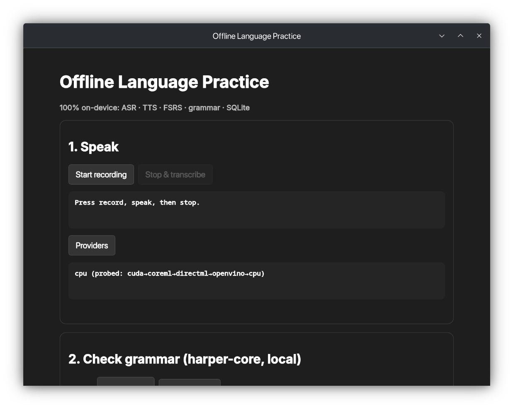

# Offline Language Practice

A desktop language-learning app that runs entirely on your machine — speech recognition, text-to-speech, and spaced-repetition flashcards, with no cloud calls and no account. Record yourself speaking a phrase, get it transcribed and graded for grammar, hear the correct pronunciation, and review vocabulary on a schedule that adapts to what you actually remember.

Everything happens on-device: the speech model, the voice synthesis, the grammar checker, and the scheduling algorithm all run locally, so it works on a plane with no wifi and never sends your voice or your study data anywhere.



## Features

- **Speaking practice** — pick a prompt, record yourself, and get scored: a sentence-level pronunciation score from CTC forced alignment, with words worth another listen marked, plus fluency (speaking rate, pauses, fillers) and grammar. About 120 built-in prompts across everyday conversation and job interviews.
- **Speech recognition** — transcription runs locally via a Wav2Vec2 ONNX model.
- **Grammar checking** — transcripts, or anything you type, are checked by a local offline linter with in-place suggestions.
- **Text-to-speech** — hear correct pronunciation via a local neural voice (Piper).
- **Spaced repetition** — review scheduled by FSRS-6, the memory model behind modern Anki, fitted to your own history. Daily caps, tags, suspend, bury and undo.
- **Your data stays yours** — JSON export that round-trips full review history and FSRS state, CSV/TSV for Anki, and whole-database backup and restore. In CSV/TSV, a card beginning with `=`, `+`, `-` or `@` gets a leading apostrophe so spreadsheets show it as text instead of running it as a formula; JSON export is unchanged.
- **Fully offline** — the only network request the app ever makes is downloading the models. After that it works with the network off.

## Why this was interesting to build

Getting five separate subsystems (speech recognition, speech synthesis, grammar checking, spaced repetition, and local storage) to share one Rust binary meant a few real constraints:

- The ONNX Runtime binding (`ort`) and the bundled TTS engine (`piper-rs`) each pin a specific, incompatible version of the same underlying library, so the inference pipeline is wired by hand in `asr.rs`/`tts.rs` rather than through a higher-level wrapper that assumes one version.
- Audio, grammar checking, and database writes each get their own thread pool so a slow model-loading step or a spaced-repetition parameter refit never freezes the UI.
- CI enforces that `package.json`, `tauri.conf.json`, and `Cargo.toml` all report the same version number before anything else runs, and denies any Rust lint warning outright.

## Quick start

```bash
npm install
npm run tauri dev
```

One terminal is enough — `beforeDevCommand` starts Vite.

The models are not in the repo and not in the installer. On first run the app walks you through downloading them (~456 MB), with progress, pause and resume; you can also get them from Settings later, or fetch them up front:

```bash
./scripts/download-models.sh
```

Either way the files are pinned to immutable upstream commits and verified by sha256 before being installed. Settings → Diagnostics tells you what was found. Without the models the app still runs, it just cannot listen or speak.

**On Linux with an NVIDIA GPU + Wayland**, WebKitGTK's DMA-BUF renderer can crash the window on launch (`Error 71 (Protocol error) dispatching to Wayland display`, then repeated `WebKit encountered an internal error`). If that happens:

```bash
WEBKIT_DISABLE_DMABUF_RENDERER=1 npm run tauri dev
```

**Intel Macs are not supported yet.** The ONNX Runtime binding ships no prebuilt library for `x86_64-apple-darwin`, so an Intel build needs ONNX Runtime compiled from source and linked in (see the `ort` linking guide). Apple Silicon Macs work.

## Tech stack

| Layer | Tech |
|---|---|
| Shell | Tauri v2 (Rust backend + WebView frontend) |
| Frontend | Preact + `@preact/signals`, TypeScript, Vite |
| Speech recognition | Wav2Vec2 via ONNX Runtime (`ort`) |
| Speech synthesis | Piper neural TTS (`piper-rs`) |
| Spaced repetition | FSRS-6 (`fsrs`) |
| Grammar checking | `harper-core`, fully offline |
| Storage | SQLite via `tauri-plugin-sql`, WAL mode, versioned migrations |

## Building

```bash
npm run build                    # tsc + vite build
cd src-tauri && cargo build --release
```

CI (`.github/workflows/ci.yml`) runs `cargo fmt`, `cargo clippy -D warnings` and `cargo test` on every push, compiles on Linux, macOS and Windows, audits dependencies with `cargo-deny`, and checks that `package.json`, `tauri.conf.json` and `Cargo.toml` agree on the version and that the release icon set exists.

Tagging `v*` builds Linux (x86_64), macOS (Apple Silicon) and Windows (x86_64) and opens a **draft** GitHub release with `SHA256SUMS` and build provenance attached (`.github/workflows/release.yml`). Binaries are not code-signed — SECURITY.md explains why and how to verify them instead.

See CONTRIBUTING.md for the house rules, which exist because breaking them has already cost real debugging time.

## License

MIT. See LICENSE.

The models are downloaded separately and carry their own licenses: the Wav2Vec2 ONNX export and the Piper LibriTTS-R voice are both MIT-licensed upstream.

The pronunciation score is calibrated against [speechocean762](https://www.openslr.org/101/) (Zhang et al., "speechocean762: An Open-Source Non-native English Speech Corpus For Pronunciation Assessment", Interspeech 2021), used under [CC BY 4.0](https://creativecommons.org/licenses/by/4.0/). Only derived numbers — a 25-point lookup table in `src-tauri/src/pronounce.rs` — are included; the corpus itself is not. Its speakers all have Mandarin as a first language, so the calibration has not been checked against other first languages. `scripts/calibrate-gop.py` reproduces the table and prints what it does and does not measure.
